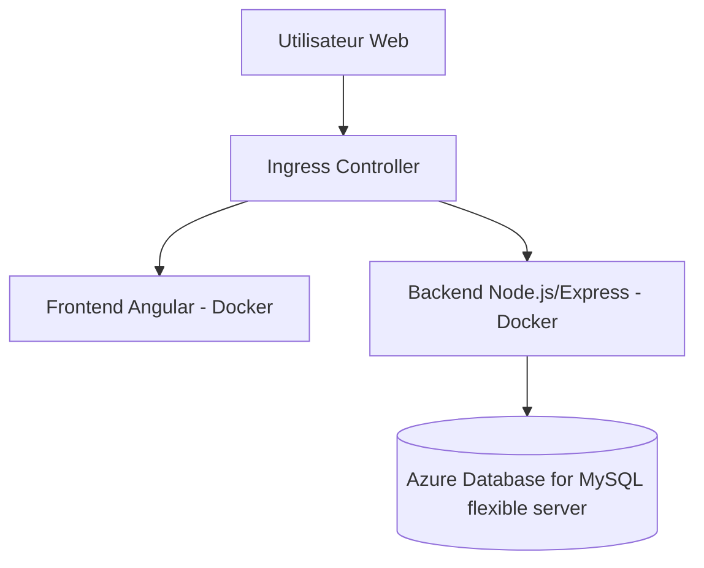

# Projet-ENI

## Arborescence du projet

```bash
Projet-ENI/
├── backend/                          # Backend Node.js (API REST)
│   ├── Dockerfile                   # Image Docker du backend
│   ├── src/                         # Code source de l'API
├── frontend/                        # Frontend Angular
│   ├── Dockerfile                   # Image Docker du frontend
│   └── src/                         # Code source Angular
│       ├── app/
│
├── docker-compose.yaml              # Orchestration locale des services
│
├── iac/                             # Infrastructure as Code (Terraform)
│   ├── main.tf
│   ├── providers.tf
│   ├── variables.tf
│   └── modules/                     # Modules Terraform réutilisables
│       ├── aks/
│       ├── keyvault/
│       ├── mysql/
│       └── network/
│
├── k8s/                             # Manifests Kubernetes
│   ├── akv-secret.yaml              # Secret via Azure Key Vault
│   ├── backend-deployment.yaml
│   ├── frontend-deployment.yaml
│   ├── ingress.yaml                 # Ingress général
│   └── grafana-ingress.yaml
│
├── monitoring/                      # Observabilité (Grafana, Prometheus)
│   └── values.yaml                  # Configuration Helm
│
└── README.md                        # Documentation générale du projet
```

## Fonctionnement de l’application

L’application suit une architecture classique **3-tiers** avec un frontal web, une API backend et une base de données.


Utilisateur Web : accède à l’application via un navigateur, en HTTPS, via l’Ingress Controller de Kubernetes.

Frontend Angular : fournit l’interface utilisateur et envoie des requêtes HTTP/REST vers le backend.

Backend Node.js/Express : expose une API REST qui gère la logique métier (ex. gestion de tâches). Il utilise Sequelize pour communiquer avec la base.

Base MySQL : stocke de manière persistante les données applicatives. En local, elle est lancée en conteneur Docker ; en production, elle repose sur Azure Database for MySQL flexible server
avec un endpoint privé.

Cette séparation permet :

Une scalabilité indépendante du front et du back (chaque composant peut être répliqué séparément dans AKS).

Une sécurité renforcée (la base de données n’est jamais exposée publiquement).

Une portabilité grâce aux conteneurs Docker, de l’environnement local jusqu’au cloud.

# Démarrage de l'application en local avec Docker

Pour faciliter le développement et les tests, l’application peut être exécutée intégralement en local grâce à **Docker** et **docker-compose**.  
Cela permet de reproduire un environnement proche de la production, avec les trois briques principales : **frontend**, **backend** et **base de données**.
---
### Frontend

Le frontend est une application **Angular** conteneurisée. Le `Dockerfile` installe Angular CLI et lance le serveur de développement sur `0.0.0.0` pour être accessible depuis l’extérieur du conteneur :

```Dockerfile
FROM node:24-alpine

WORKDIR /usr/src/app

COPY . /usr/src/app

RUN npm install -g @angular/cli
RUN npm install

CMD ["ng", "serve", "--host", "0.0.0.0"]
````

Construction de l’image :

```bash
docker build -t projet-eni-frontend .
```
---
### Backend

Le backend est une API **Node.js / Express** utilisant **Sequelize** pour communiquer avec la base de données.
Le `Dockerfile` expose le port `3000` et démarre le serveur via npm :

```Dockerfile
FROM node:24-alpine

WORKDIR /usr/src/app

COPY . .

RUN npm install

EXPOSE 3000

ENTRYPOINT ["npm", "run", "start"]
```

Construction de l’image :

```bash
docker build -t projet-eni-backend .
```

---

### Base de données & orchestration docker-compose

L’ensemble est orchestré avec **docker-compose**, qui déploie également la base **MariaDB**.
La base est initialisée automatiquement au premier lancement grâce au script SQL `scriptSQL.sql` (présent dans le dossier `backend`).

```yaml
version: '3'
services:
  database:
    image: mariadb
    environment:
      MYSQL_DATABASE: todolist_db
      MARIADB_ALLOW_EMPTY_ROOT_PASSWORD: "yes"
    volumes:
      - db_data:/var/lib/mysql
      - ./backend/scriptSQL.sql:/docker-entrypoint-initdb.d/scriptSQL.sql
    ports:
      - "3306:3306"

  frontend:
    image: frontend-projet-eni
    ports:
      - "4200:4200"

  backend:
    image: backend-projet-eni
    env_file: .env
    ports:
      - "3000:3000"

volumes:
  db_data:
```

Fichier `.env` utilisé par le backend :

```
DB_HOST=database
DB_USER=root
DB_PASSWORD=
DB_NAME=todolist_db
DB_DIALECT=mysql
PORT=3000
```
---
### Lancement de l’application

Pour lancer toute la stack (frontend + backend + base de données) :

```bash
docker-compose up -d
```

* Frontend accessible sur : 👉 [http://localhost:4200](http://localhost:4200)
* Backend API sur : 👉 [http://localhost:3000/api](http://localhost:3000/api)
* Base de données MariaDB exposée sur : `localhost:3306`

---

### Résumé du fonctionnement en local

1. **docker-compose** démarre les 3 services (`frontend`, `backend`, `database`).
2. Au démarrage, **MariaDB** exécute automatiquement le script `scriptSQL.sql` pour initialiser la base.
3. Le **backend** se connecte à la base via les variables du fichier `.env`.
4. Le **frontend Angular** appelle les endpoints REST du backend sur `http://localhost:3000/api`.
5. L’utilisateur accède à l’interface Angular via son navigateur (`localhost:4200`).

Ce workflow permet de développer, tester et déboguer localement avant de déployer sur AKS.

# Provisionnement sur Azure

## 1. Infrastructure Azure

L’infrastructure repose sur plusieurs briques Azure provisionnées par **Terraform** :

### Ressources principales

- **Resource Group** dédié au projet (`rg-projet-eni`)
- **Virtual Network (VNet)** avec un sous-réseau isolé pour AKS
- **Azure Kubernetes Service (AKS)** en mode **System Assigned Identity**
- **Azure Database for MariaDB** (service managé, non exposé publiquement)
- **Azure Key Vault** pour le stockage sécurisé des secrets
- **Azure Private DNS Zone** pour la résolution interne des services PaaS

### Topologie réseau

- Le cluster AKS est déployé dans un **VNet dédié**.  
- La base MariaDB est **privée** et reliée au VNet via une **Private Endpoint**.  
- Une **zone DNS privée** (`mysql.database.azure.com`) est associée pour permettre la résolution transparente dans AKS.  
- Les pods du cluster utilisent **Azure CNI** pour bénéficier d’adresses IP réseau réelles, ce qui facilite la communication privée avec MariaDB.  

---

## 2. Provisionnement Terraform

L’infrastructure est décrite en **Terraform** dans le dossier `iac/`.

### a. Cluster AKS

```terraform
resource "azurerm_kubernetes_cluster" "k8s" {
  name                = var.cluster_name
  location            = var.location
  resource_group_name = var.resource_group_name
  dns_prefix          = var.dns_prefix

  identity {
    type = "SystemAssigned"
  }

  default_node_pool {
    name           = "default"
    node_count     = 2
    vm_size        = "Standard_B2s"
    vnet_subnet_id = var.subnet_id
  }

  network_profile {
    network_plugin = "azure"
    network_policy = "calico"
    service_cidr   = "10.0.0.0/16"
    dns_service_ip = "10.0.0.10"
  }

  role_based_access_control_enabled = true
}
````

Caractéristiques :

* **VM Standard\_B2s** pour le node pool par défaut (2 nœuds).
* **Azure CNI + Calico** pour combiner scalabilité et Network Policies.
* **RBAC** activé (intégration Azure AD possible pour la gestion des accès).

### b. Réseau et DNS

```terraform
resource "azurerm_virtual_network" "vnet" {
  name                = "aks-vnet"
  resource_group_name = var.resource_group_name
  location            = var.location
  address_space       = ["10.1.0.0/16"]
}

resource "azurerm_subnet" "aks" {
  name                 = "aks-subnet"
  resource_group_name  = var.resource_group_name
  virtual_network_name = azurerm_virtual_network.vnet.name
  address_prefixes     = ["10.1.1.0/24"]
}
```

* Subnet dédié pour isoler les workloads.
* Association avec la **zone DNS privée** pour MariaDB.

### c. Gestion des secrets avec Azure Key Vault

```terraform
resource "azurerm_key_vault" "kv" {
  name                = "kv-projet-eni"
  location            = var.location
  resource_group_name = var.resource_group_name
  tenant_id           = var.tenant_id
  sku_name            = "standard"
}
```

Les secrets (ex. mot de passe DB) sont stockés dans le Key Vault et montés dans Kubernetes via le **Secrets Store CSI Driver**.

---

## 3. Déploiement Kubernetes

Une fois AKS provisionné, les workloads applicatifs sont déployés avec des **manifests Kubernetes** :

* **Deployments** pour `frontend` et `backend`
* **Services ClusterIP** pour l’interconnexion interne
* **Ingress Controller (NGINX)** pour exposer les applications en HTTPS
* **ConfigMaps et Secrets** pour injecter la configuration et les credentials depuis Key Vault

Exemple de SecretProviderClass pour MariaDB :

```yaml
apiVersion: secrets-store.csi.x-k8s.io/v1
kind: SecretProviderClass
metadata:
  name: azure-kv-mariadb
spec:
  provider: azure
  parameters:
    usePodIdentity: "false"
    useVMManagedIdentity: "true"
    userAssignedIdentityID: "<CLIENT_ID_MI>"
    keyvaultName: "<KV_NAME>"
    objects: |
      array:
        - |
          objectName: mysql-password
          objectType: secret
    tenantId: "<TENANT_ID>"
```

---

## 4. CI/CD GitHub Actions

La chaîne CI/CD est définie dans `.github/workflows/` :

* **Trigger** : push sur la branche `main`
* **Jobs** :

    * Build de l’image Docker (`frontend` et `backend`)
    * Tests unitaires
    * Push sur Docker Hub
* **Secrets CI/CD** : `DOCKER_USERNAME`, `DOCKER_PASSWORD` stockés dans GitHub

Cela garantit que chaque modification du code produit immédiatement une image Docker prête pour le déploiement sur AKS.

---

## 5. Monitoring et observabilité

Le cluster est équipé d’une **stack de supervision** :

* **Prometheus** : collecte des métriques Kubernetes et applicatives
* **Grafana** : dashboards et alertes personnalisées
* **Ingress sécurisé en HTTPS** avec Cert-Manager + Let’s Encrypt

Exemple d’extrait Helm values pour Grafana :

```yaml
grafana:
  adminUser: "admin"
  adminPasswordExistingSecret: "grafana-admin"
  ingress:
    enabled: true
    ingressClassName: nginx
    hosts:
      - grafana.mydomain.com
    tls:
      - secretName: grafana-tls
        hosts:
          - grafana.mydomain.com
```
