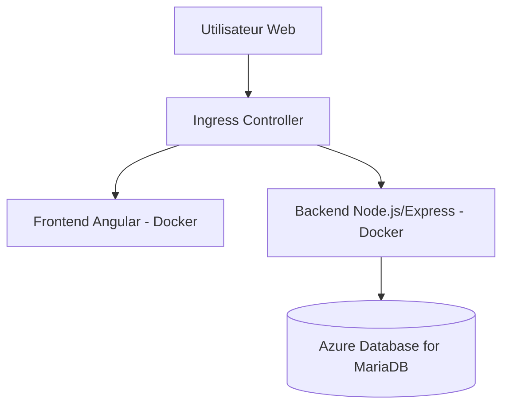

# Projet-ENI

## Architecture globale

L’architecture web suit le schéma suivant :
```
            ┌──────────────────────┐
            │   Utilisateur Web     │
            └─────────┬────────────┘
                      │
                (Ingress Controller)
                      │
       ┌─────────────────┴──────────────────┐
       │                                    │
┌──────▼───────┐                     ┌──────▼─────────┐
│ Frontend     │ Angular (port 80)   │ Backend        │ Node.js + Express (port 3000)
│ (Docker)     │ <--- API REST ----> │ (Docker)       │
└──────┬───────┘                     └──────┬─────────┘
       │                                    │
       └───────────────┐     ┌──────────────┘
                       ▼     ▼
                ┌────────────────────┐
                │   Azure MariaDB    │
                │ (service managé)   │
                └────────────────────┘
```

## 1. Infrastructure Azure

L’infrastructure repose sur plusieurs briques Azure provisionnées par **Terraform** :

### Ressources principales

- **Resource Group** dédié au projet (`rg-projet-eni`)
- **Virtual Network (VNet)** avec un sous-réseau isolé pour AKS
- **Azure Kubernetes Service (AKS)** en mode **System Assigned Identity**
- **Azure Database for MariaDB** (service managé, non exposé publiquement)
- **Azure Key Vault** pour le stockage sécurisé des secrets
- **Azure Private DNS Zone** pour la résolution interne des services PaaS

### Topologie réseau

- Le cluster AKS est déployé dans un **VNet dédié**.  
- La base MariaDB est **privée** et reliée au VNet via une **Private Endpoint**.  
- Une **zone DNS privée** (`mysql.database.azure.com`) est associée pour permettre la résolution transparente dans AKS.  
- Les pods du cluster utilisent **Azure CNI** pour bénéficier d’adresses IP réseau réelles, ce qui facilite la communication privée avec MariaDB.  

---




## 2. Provisionnement Terraform

L’infrastructure est décrite en **Terraform** dans le dossier `iac/`.

### a. Cluster AKS

```terraform
resource "azurerm_kubernetes_cluster" "k8s" {
  name                = var.cluster_name
  location            = var.location
  resource_group_name = var.resource_group_name
  dns_prefix          = var.dns_prefix

  identity {
    type = "SystemAssigned"
  }

  default_node_pool {
    name           = "default"
    node_count     = 2
    vm_size        = "Standard_B2s"
    vnet_subnet_id = var.subnet_id
  }

  network_profile {
    network_plugin = "azure"
    network_policy = "calico"
    service_cidr   = "10.0.0.0/16"
    dns_service_ip = "10.0.0.10"
  }

  role_based_access_control_enabled = true
}
````

Caractéristiques :

* **VM Standard\_B2s** pour le node pool par défaut (2 nœuds).
* **Azure CNI + Calico** pour combiner scalabilité et Network Policies.
* **RBAC** activé (intégration Azure AD possible pour la gestion des accès).

### b. Réseau et DNS

```terraform
resource "azurerm_virtual_network" "vnet" {
  name                = "aks-vnet"
  resource_group_name = var.resource_group_name
  location            = var.location
  address_space       = ["10.1.0.0/16"]
}

resource "azurerm_subnet" "aks" {
  name                 = "aks-subnet"
  resource_group_name  = var.resource_group_name
  virtual_network_name = azurerm_virtual_network.vnet.name
  address_prefixes     = ["10.1.1.0/24"]
}
```

* Subnet dédié pour isoler les workloads.
* Association avec la **zone DNS privée** pour MariaDB.

### c. Gestion des secrets avec Azure Key Vault

```terraform
resource "azurerm_key_vault" "kv" {
  name                = "kv-projet-eni"
  location            = var.location
  resource_group_name = var.resource_group_name
  tenant_id           = var.tenant_id
  sku_name            = "standard"
}
```

Les secrets (ex. mot de passe DB) sont stockés dans le Key Vault et montés dans Kubernetes via le **Secrets Store CSI Driver**.

---

## 3. Déploiement Kubernetes

Une fois AKS provisionné, les workloads applicatifs sont déployés avec des **manifests Kubernetes** :

* **Deployments** pour `frontend` et `backend`
* **Services ClusterIP** pour l’interconnexion interne
* **Ingress Controller (NGINX)** pour exposer les applications en HTTPS
* **ConfigMaps et Secrets** pour injecter la configuration et les credentials depuis Key Vault

Exemple de SecretProviderClass pour MariaDB :

```yaml
apiVersion: secrets-store.csi.x-k8s.io/v1
kind: SecretProviderClass
metadata:
  name: azure-kv-mariadb
spec:
  provider: azure
  parameters:
    usePodIdentity: "false"
    useVMManagedIdentity: "true"
    userAssignedIdentityID: "<CLIENT_ID_MI>"
    keyvaultName: "<KV_NAME>"
    objects: |
      array:
        - |
          objectName: mysql-password
          objectType: secret
    tenantId: "<TENANT_ID>"
```

---

## 4. CI/CD GitHub Actions

La chaîne CI/CD est définie dans `.github/workflows/` :

* **Trigger** : push sur la branche `main`
* **Jobs** :

    * Build de l’image Docker (`frontend` et `backend`)
    * Tests unitaires
    * Push sur Docker Hub
* **Secrets CI/CD** : `DOCKER_USERNAME`, `DOCKER_PASSWORD` stockés dans GitHub

Cela garantit que chaque modification du code produit immédiatement une image Docker prête pour le déploiement sur AKS.

---

## 5. Monitoring et observabilité

Le cluster est équipé d’une **stack de supervision** :

* **Prometheus** : collecte des métriques Kubernetes et applicatives
* **Grafana** : dashboards et alertes personnalisées
* **Ingress sécurisé en HTTPS** avec Cert-Manager + Let’s Encrypt

Exemple d’extrait Helm values pour Grafana :

```yaml
grafana:
  adminUser: "admin"
  adminPasswordExistingSecret: "grafana-admin"
  ingress:
    enabled: true
    ingressClassName: nginx
    hosts:
      - grafana.mydomain.com
    tls:
      - secretName: grafana-tls
        hosts:
          - grafana.mydomain.com
```
